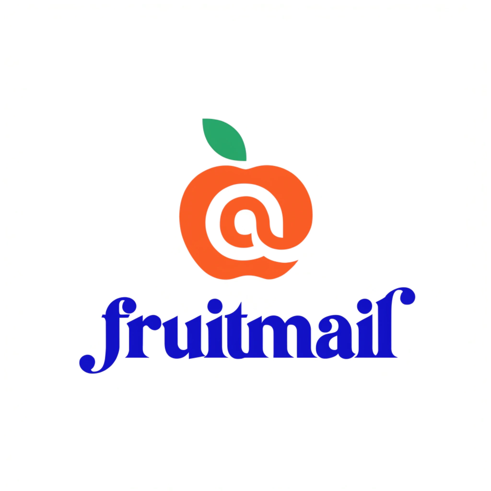

# Fruitmail (Fast & Safe)

Fast SQLite-based search for Apple Mail.app with full body content support.


## ✨ Features

- **⚡ Fast:** Direct read-only SQLite access (zero-copy default)
- **🔒 Safe:** Uses read-only mode by default, or copies DB with `--copy` flag
- **📧 Body content:** Read full email bodies via AppleScript (fast for a few emails)
- **🔍 Full search:** Search by subject, sender, recipient, date range, attachments, and more

## 📦 Installation
 
 **Using npm (Recommended):**
 ```bash
 npm install -g apple-mail-search-cli
 ```
 
 **Using Bash (Zero dependency):**
 ```bash
 curl -sSL https://raw.githubusercontent.com/gumadeiras/fruitmail-cli/master/fruitmail | bash
 ```
 
 ## 🚀 Usage
 
 ```bash
 # Complex search
 fruitmail search --subject "invoice" --days 30 --unread
 
 # Search by sender
 fruitmail sender "@amazon.com"
 
 # List unread emails
 fruitmail unread
 
 # Read full email body (supports --json)
 fruitmail body 94695
 
 # Open in Mail.app
 fruitmail open 94695
 
 # Database stats
 fruitmail stats
 ```

## 📊 Performance

| Method | Time for 130k emails |
|--------|---------------------|
| AppleScript (full iteration) | 8+ minutes |
| SQLite (this tool) | **~50ms** |

## 🏗️ Technical Details

- **Database:** `~/Library/Mail/V{9,10,11}/MailData/Envelope Index`
- **Query method:** SQLite (read-only) + AppleScript (body content)
- **Safety:** Read-only mode prevents modification; optional `--copy` mode available

## 🛠️ Scripts

- `./scripts/committer "message" path...`: stage only the listed paths and create a commit
- `./scripts/release check 1.1.0`: verify synced release versions and run the release test gates
- `./scripts/release run 1.1.0`: bump versions, run tests, package artifacts, tag, push, and publish the GitHub release

## 🔗 ClawHub

Available as a skill on [ClawHub](https://clawhub.ai/gumadeiras/apple-mail-search-safe) for [OpenClaw](https://github.com/openclaw/openclaw) users. Install with:

```bash
clawhub install apple-mail-search-safe
```

## 📝 License

MIT
